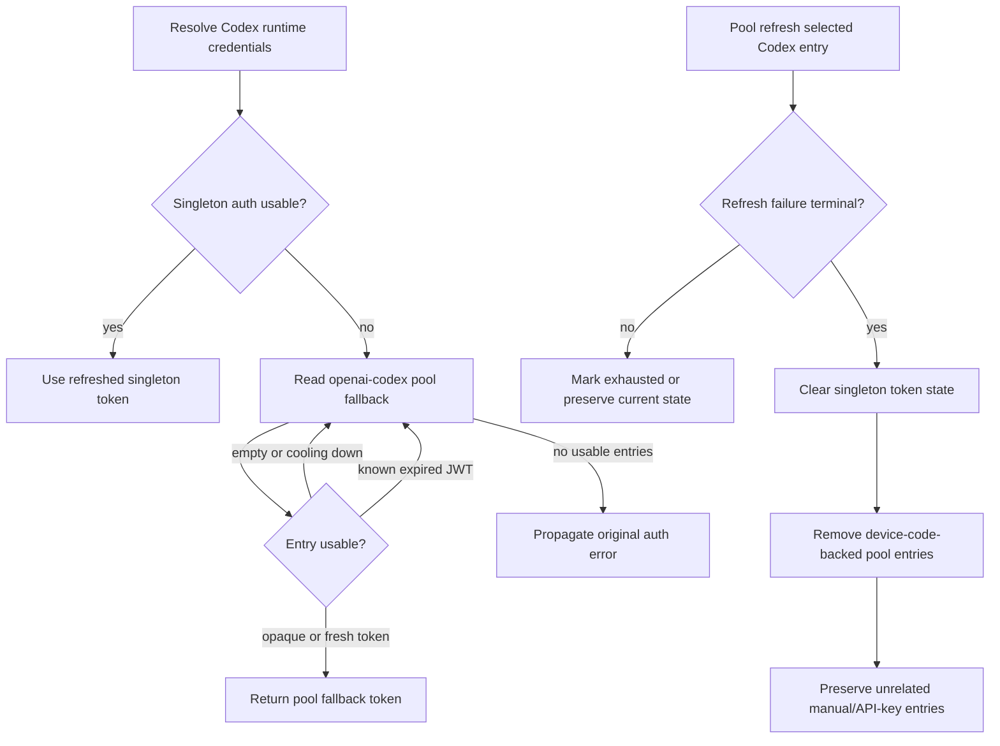

# fix: Prevent Codex stale-token replay

## Summary

Repair the recovered default/Akira Codex failure path in two separated tracks: a guarded operator step updates the stale launchd service definition, and test-first runtime patches prevent expired Codex pool tokens and dead manual device-code entries from being replayed.

---

## Problem Frame

The default/Akira gateway recovered only after copying fresh `openai-codex` pool entries into that profile and restarting the gateway. The underlying bug remains: terminal Codex refresh failure can leave `manual:device_code` pool entries behind, and the raw pool fallback can still return an expired access JWT when singleton auth is absent.

The installed default launchd plist is also stale relative to the current generator. That repair reloads a live gateway service, so this plan treats it as an approval-gated operations unit rather than an automatic implementation step.

---

## Requirements

**Launchd service repair**

- R1. Repair the default launchd gateway service definition so `hermes gateway status` no longer reports it stale after an approved repair.
- R2. Preserve the approval boundary for live gateway reloads, restarts, and service-manager changes.

**Codex stale-token prevention**

- R3. Codex runtime fallback must not return an expired pool access JWT when singleton Codex auth is missing or invalid.
- R4. Codex runtime fallback must still return a usable non-expired pool token when one exists.
- R5. Terminal Codex OAuth refresh failure must remove or quarantine both `device_code` and `manual:device_code` pool entries.
- R6. Terminal Codex OAuth refresh failure must preserve unrelated manual/API-key pool entries.

**Scope hygiene**

- R7. The implementation must not touch startup-notify monkeypatch retirement or its `.pth` loader in this scope.
- R8. The implementation must not mix this fix with unrelated uncommitted gateway/runtime-footer/streaming changes already present in the working tree.

---

## Key Technical Decisions

- **Separate ops repair from code fix:** launchd plist repair is necessary but live-stateful; keeping it as an approval-gated unit avoids sneaking a gateway reload into a code implementation task.
- **Validate pool fallback tokens before returning them:** `_pool_codex_access_token()` is the final compatibility fallback before the gateway sends a bearer token, so expiry rejection belongs there even though the normal pool path should refresh or rotate first. Reject tokens with known expired JWT claims while preserving true opaque-token compatibility.
- **Keep fallback expiry handling read-only:** the raw fallback should skip unusable entries without mutating pool state; terminal refresh handling remains responsible for quarantine and persistence.
- **Treat `manual:device_code` as device-code-backed for terminal quarantine only:** `device_code` and `manual:device_code` share the same terminal OAuth invalidation risk, while other `manual:*` or API-key entries are independent credentials that must survive.
- **Patch by vertical TDD slices:** the expired-token fallback and terminal-quarantine defects are related but distinct; each gets its own failing regression before its production change.
- **Do not widen manual-source matching:** only `device_code` and `manual:device_code` are in the quarantine set; broad `manual:*` removal risks deleting valid user-added credentials.

---

## High-Level Technical Design

The fix guards both places where dead Codex credentials can survive: raw runtime fallback and terminal refresh quarantine.

The diagram is directional: the production patch should follow existing helper boundaries and locking patterns rather than introducing a new credential lifecycle abstraction.

---

## Scope Boundaries

### In Scope

- Approval-gated repair and verification of the default launchd service definition.
- Regression coverage and production fixes for Codex expired pool fallback and terminal refresh quarantine.
- Focused verification of the touched auth/runtime and credential-pool paths.

### Deferred to Follow-Up Work

- Startup-notify monkeypatch retirement and `.pth` loader cleanup.
- Broader gateway restart-notification hardening beyond verifying the launchd repair did not regress existing behavior.
- Cleaning or landing unrelated uncommitted gateway, footer, streaming, package, or lockfile changes.

---

## Implementation Units

### U1. Approval-gated launchd service definition repair

- **Goal:** Define and execute, only after explicit approval, the default gateway service-definition repair and health verification.
- **Requirements:** R1, R2
- **Dependencies:** None
- **Files:**
  - Reference: `hermes_cli/gateway.py`
  - Reference: `tests/hermes_cli/test_gateway_service.py`
- **Approach:** Treat current launchd generation and refresh behavior as the pattern to use, not as code to rewrite. The implementer should request approval before any command that writes the installed plist, bootouts, bootstraps, reloads, restarts, or otherwise changes launchd state. Preflight must capture the target default profile identity, launchd label, installed plist path/content, generated definition fingerprint, PID/status, and timestamp before repair. Use a clean environment that removes the gateway self-protection marker before invoking the repair path.
- **Patterns to follow:** `generate_launchd_plist()`, `launchd_plist_is_current()`, `refresh_launchd_plist_if_needed()`, and existing launchd refresh tests in `tests/hermes_cli/test_gateway_service.py`.
- **Test scenarios:**
  - Test expectation: none — this unit is an operator action over the live default service definition, not a feature-bearing code change.
- **Verification:** After approved repair, `hermes gateway status` for the default profile reports no stale service warning, launchd reports the default gateway label as running with a PID, and the gateway remains reachable without new auth-error log deltas. If reload leaves the service unhealthy, stop code-path verification through the live service and restore or report from the captured pre-repair service definition.

### U2. Expired Codex pool fallback regression

- **Goal:** Add failing coverage proving the raw Codex pool fallback skips expired access JWTs instead of replaying them.
- **Requirements:** R3, R4
- **Dependencies:** None
- **Files:**
  - `tests/hermes_cli/test_auth_codex_provider.py`
- **Execution note:** Start with a failing regression before changing `hermes_cli/auth.py`.
- **Approach:** Extend the existing pool-fallback tests around singleton-missing auth stores. Use JWTs with explicit `exp` claims so the behavior is deterministic and does not expose real tokens.
- **Patterns to follow:** Existing `_jwt_with_exp()` helper and tests for pool fallback, cooldown skipping, and no-usable-entry propagation.
- **Test scenarios:**
  - Given singleton Codex auth is absent and the first pool entry has an expired access JWT, when runtime credentials resolve, then that expired token is skipped and a later fresh pool token is returned.
  - Given singleton Codex auth is absent and every pool entry is empty, cooling down, or expired, when runtime credentials resolve, then the original Codex auth-missing error propagates instead of returning a stale bearer.
  - Given singleton Codex auth is absent and the first usable pool token is opaque or otherwise non-JWT, when runtime credentials resolve, then existing compatibility behavior is preserved unless the token is explicitly known expired.
  - Given a JWT-shaped token is malformed or has unusable expiry claims, when runtime credentials resolve, then the fallback rejects that token while preserving compatibility for clearly opaque non-JWT tokens.
  - Given token expiry is at the current boundary, when runtime credentials resolve under controlled time, then `exp <= now` is unusable and the fallback does not replay the token.
- **Verification:** The new regression fails before the production change for the expired-JWT case and passes after U3.

### U3. Runtime fallback expiry guard

- **Goal:** Make `_pool_codex_access_token()` skip expired pool access tokens while preserving existing cooldown and compatibility behavior.
- **Requirements:** R3, R4
- **Dependencies:** U2
- **Files:**
  - `hermes_cli/auth.py`
  - `tests/hermes_cli/test_auth_codex_provider.py`
- **Approach:** Reuse the existing Codex JWT expiry helper rather than adding a new decoder. Keep the fallback conservative: reject tokens known to be expired, expiring now, or JWT-shaped but malformed; skip entries in exhaustion cooldown; preserve compatibility for clearly opaque non-JWT tokens.
- **Patterns to follow:** `_codex_access_token_is_expiring()`, `_decode_jwt_claims()`, and `_pool_codex_access_token()`'s existing auth-store locking and error-swallowing shape.
- **Test scenarios:**
  - Covered by U2. Expired access JWT is skipped and a later usable token is selected.
  - Covered by U2. All unusable pool entries result in the existing auth-missing failure path.
  - Existing cooldown-skipping fallback tests still pass unchanged.
- **Verification:** Focused Codex auth-provider tests pass, and the resolver no longer produces a credential dict whose `api_key` is a known-expired pool JWT.

### U4. Manual device-code terminal quarantine regression

- **Goal:** Add failing coverage proving terminal Codex refresh failure removes `manual:device_code` entries while preserving unrelated manual entries.
- **Requirements:** R5, R6
- **Dependencies:** None
- **Files:**
  - `tests/agent/test_credential_pool.py`
- **Execution note:** Add this regression after U3 is green; do not patch `agent/credential_pool.py` first.
- **Approach:** Extend the existing terminal Codex refresh test with a device-code-backed manual entry and an unrelated manual/API-key survivor. Persisted pool assertions should verify both in-memory and auth-store state.
- **Patterns to follow:** `test_codex_oauth_terminal_refresh_clears_auth_json_and_removes_pool_entries()` and terminal error classification tests near it.
- **Test scenarios:**
  - Given the pool contains `device_code`, `manual:device_code`, and an unrelated manual/API-key entry, when Codex refresh raises a terminal OAuth error, then both device-code-backed entries are removed and only the unrelated manual entry survives.
  - Given terminal refresh clears singleton Codex auth, when the pool is persisted, then persisted `credential_pool.openai-codex` also excludes both device-code-backed entries.
  - Given a nonterminal Codex refresh failure, when refresh is attempted, then neither singleton auth nor device-code-backed entries are quarantined.
  - Given the unrelated manual/API-key entry survives terminal quarantine, when assertions inspect it, then its `id`, `source`, and `auth_type` remain unchanged.
- **Verification:** The new manual-device-code quarantine assertion fails before the production change and passes after U5.

### U5. Credential-pool quarantine source set

- **Goal:** Update Codex terminal refresh quarantine to treat `manual:device_code` as device-code-backed without deleting unrelated manual credentials.
- **Requirements:** R5, R6, R8
- **Dependencies:** U4
- **Files:**
  - `agent/credential_pool.py`
  - `tests/agent/test_credential_pool.py`
- **Approach:** Replace the exact `device_code` terminal-quarantine filter with a narrow source set containing `device_code` and `manual:device_code`. Inventory existing Codex source semantics in nearby code/tests before widening anything else. Keep sync/writeback semantics unchanged unless the failing regression proves they need the same source set; do not refactor unrelated provider pooling.
- **Patterns to follow:** Nous terminal quarantine's singleton-source set and existing Codex `_save_codex_tokens()` sync coverage for `manual:device_code`.
- **Test scenarios:**
  - Covered by U4. Terminal Codex refresh failure removes both device-code-backed source shapes.
  - Covered by U4. Unrelated manual/API-key entries remain available and persisted.
  - Existing terminal/nonterminal Codex refresh tests remain green.
- **Verification:** Focused credential-pool tests pass, and persisted auth-store state cannot keep a dead `manual:device_code` entry after terminal refresh failure.

### U6. Focused integration verification and workspace hygiene

- **Goal:** Verify the fix without trampling unrelated working-tree changes or leaking secrets.
- **Requirements:** R2, R7, R8
- **Dependencies:** U3, U5; U1 only when the live launchd repair was approved and executed
- **Files:**
  - `tests/hermes_cli/test_auth_codex_provider.py`
  - `tests/agent/test_credential_pool.py`
  - `tests/hermes_cli/test_gateway_service.py`
- **Approach:** Run focused tests for the changed auth and pool behavior, then inspect the diff to ensure only the intended files changed. New tests should compare sentinel labels, entry IDs, or decoded claim metadata rather than complete token strings. If launchd repair was approved and executed, verify live state using labels, timestamps, PIDs, and sanitized log-delta counts only; never print token values. Keep development-profile state separate from default-profile service verification, and do not copy credentials between profiles in this plan.
- **Patterns to follow:** Repo testing convention with `-o 'addopts='`, temp `HERMES_HOME` isolation in tests, and Hermes operations secret-reporting discipline.
- **Test scenarios:**
  - Focused Codex auth-provider tests cover expired fallback selection and no-usable-entry failure.
  - Focused credential-pool tests cover terminal and nonterminal Codex refresh handling.
  - Existing launchd service tests cover stale plist refresh behavior without touching the live user service.
- **Verification:** Targeted tests pass, changed-file inspection stays scoped to intended auth/pool/test files unless U1 approval caused live ops only, and no startup-notify monkeypatch files or unrelated gateway changes are modified. Captured logs, diffs, and assertion output contain no `Authorization` headers, access tokens, refresh tokens, or raw JWT strings.

---

## System-Wide Impact

This plan affects the default/Akira gateway's service manager state and the shared Codex credential lifecycle. The code changes sit in runtime credential resolution and pool refresh cleanup, so a bad patch can break Codex auth for CLI, gateway, cron, and any profile using `openai-codex` pools. The `manual:device_code` source classification is device-code-backed only for terminal Codex quarantine, not a general rule for all manual credentials. The launchd repair affects the live default gateway only if explicitly approved and executed.

---

## Risks & Dependencies

- **Live restart risk:** launchd repair reloads the default gateway service. Mitigation: require explicit approval, remove `_HERMES_GATEWAY` from the repair command environment, and verify running state afterward.
- **Wrong-profile risk:** operating from a named profile can mask the default profile's service and auth state. Mitigation: preflight the target default profile, launchd label, and installed plist before any live repair.
- **Credential deletion risk:** over-broad manual-source matching could remove valid user-added credentials. Mitigation: quarantine only `device_code` and `manual:device_code`.
- **Compatibility risk:** rejecting opaque pool tokens could break non-JWT test or fallback credentials. Mitigation: reuse existing Codex expiry helper and preserve its current opaque-token behavior.
- **Partial-persistence risk:** terminal quarantine updates singleton auth and pool entries together. Mitigation: keep updates under existing auth-store locking/persistence patterns and verify persisted state matches in-memory survivors.
- **Workspace contamination risk:** the repo already has unrelated uncommitted changes. Mitigation: implement on an isolated branch/worktree or verify touched files before editing.
- **Secret exposure risk:** auth tests and live verification must use synthetic tokens or sanitized metadata only.

---

## Documentation / Operational Notes

- Keep the launchd repair, runtime bug patch, and startup-notify monkeypatch retirement as separate scopes.
- If the live repair runs, record only service label, PID, status, and sanitized log deltas.
- If startup-notify monkeypatch evidence appears during verification, document it as follow-up evidence; do not modify the patch or loader in this plan.

---

## Sources & Research

- `AGENTS.md` for Hermes repo structure, test posture, and profile-safe path conventions.
- `hermes_cli/auth.py` for Codex singleton runtime auth and raw pool fallback behavior.
- `agent/credential_pool.py` for Codex refresh, terminal quarantine, and provider-specific source handling.
- `hermes_cli/gateway.py` and `tests/hermes_cli/test_gateway_service.py` for launchd plist generation and refresh behavior.
- `tests/hermes_cli/test_auth_codex_provider.py` and `tests/agent/test_credential_pool.py` for existing regression-test patterns.
- Hermes operations references for Codex profile auth divergence, macOS launchd restart behavior, and startup-notify monkeypatch retirement boundaries.
