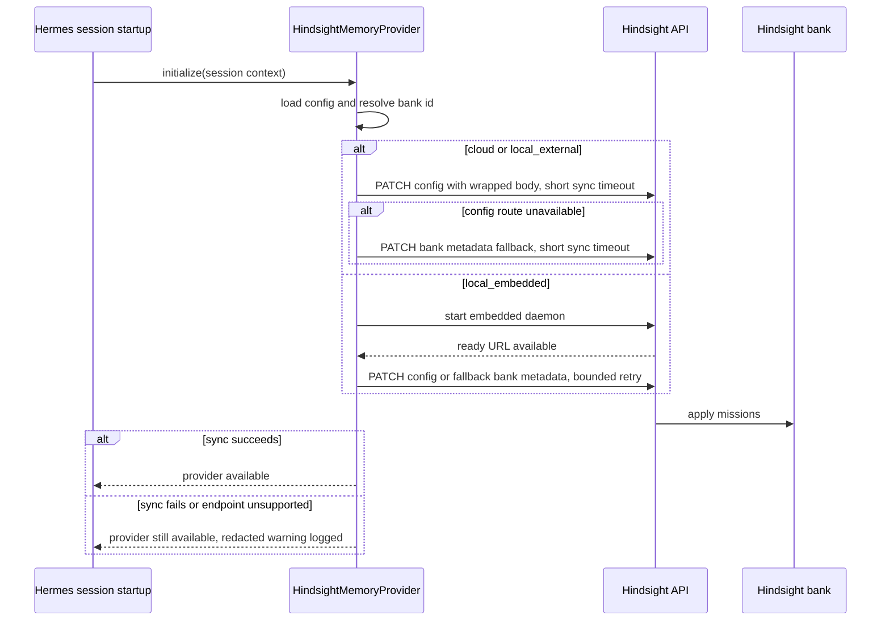
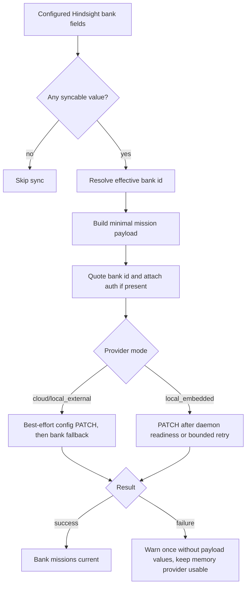

# fix: Sync Hindsight bank mission configuration

**Target repo:** `hermes-agent`

## Summary

This plan fixes the Hindsight memory provider so configured bank mission fields are applied to the live Hindsight bank through a compatible Banks API path. It deliberately corrects the abandoned PR shape, keeps startup fail-open, and separates upstream code work from any local runtime patch or gateway restart.

---

## Problem Frame

Hermes already reads `bank_mission` and `bank_retain_mission` from Hindsight config, and the plugin README claims those values are applied through the Banks API. The current provider never syncs them, so `hermes-ops` can have the right config on disk while the live Hindsight bank silently keeps default or stale `reflect_mission` and `retain_mission` state.

PR #30068 attempted to fix this but was closed unmerged, and its implementation shape is not safe for our installed API. It used the gated bank-config endpoint with a bare payload, while the installed API expects a wrapped config update there and the ungated bank endpoint accepts the relevant fields together. The best fix is not a byte-faithful cherry-pick; it is a clean provider change that uses the correct endpoint semantics and has tests proving the endpoint, payload, startup behavior, and failure isolation.

---

## Requirements

**Bank mission sync**

- R1. The provider must apply configured `bank_mission` to the bank's `reflect_mission` field.
- R2. The provider must apply configured `bank_retain_mission` to the bank's `retain_mission` field.
- R3. Upstream provider code must not hardcode profile display names; any bank `name` sync must come from an explicit `bank_name` config field or remain local-carry-only.
- R4. The provider must patch the resolved bank ID after `bank_id_template` expansion, not the static fallback.

**API compatibility and startup safety**

- R5. The sync path must never call the abandoned `/config` bare-payload shape; it may prefer wrapped `/config` when enabled and must fall back to the bank endpoint when that route is gated or unavailable.
- R6. Sync failures, unsupported endpoints, daemon warmup races, and timeouts must not abort provider initialization or break retain/recall/reflect.
- R7. `local_embedded` sync must run only after the embedded daemon is started or be deferred behind a startup-safe retry path.
- R8. The request must quote bank IDs in the URL, preserve auth headers when configured, and avoid logging secrets.

**Operational discipline**

- R9. Implementation must not touch unrelated dirty gateway/footer files in the runtime checkout.
- R10. During implementation and verification, no direct live `hermes-ops` bank mutation, gateway restart, provider swap, or runtime config write happens without explicit approval; deployed provider behavior may later sync configured bank metadata at startup.
- R11. If we need a temporary local carry before upstream merge, it must be a disciplined Hermes patch with a retirement condition, not an untracked edit to the live runtime checkout.
- R12. Existing Hindsight patch loader paths must be verified before relying on any local carry, because profile `HOME` redirection can make `~/.hermes/patches` resolve incorrectly.

---

## Key Technical Decisions

- **Use capability-based endpoint selection:** Prefer the canonical `/config` route only with the wrapped update body when it is enabled and authorized; fall back to `PATCH /v1/default/banks/{bank_id}` with a CreateBankRequest-shaped payload when `/config` is gated or unavailable. Never use the abandoned bare-payload `/config` shape.
- **Make sync best-effort and fail-open:** Bank mission state improves memory attribution, but startup availability is more important. HTTP errors, unsupported endpoints, and daemon timing failures become warnings, not initialization failures.
- **Treat `local_embedded` as a sequencing problem:** Cloud and local-external modes can sync after config resolution; embedded mode needs sync after daemon readiness or a bounded retry because the HTTP server may not exist when `initialize()` starts.
- **Use a dedicated sync timeout:** Bank metadata sync must use a small bounded timeout, separate from the normal Hindsight operation timeout, so optional metadata work cannot block startup for the provider's 120-second default.
- **Extract embedded startup seams before wiring sync:** The current embedded daemon startup is an inline closure. Mission sync needs its own isolated `try/except` after daemon readiness so a sync failure is not reported as daemon startup failure.
- **Do not rely on broad MCP exposure:** Hindsight has native surfaces, but enabling broad MCP/admin tools is unnecessary for this fix and expands the blast radius.
- **Keep local carry separate from upstream fix:** The upstream-quality code path belongs in `plugins/memory/hindsight/__init__.py`; a local patch is only a temporary deployment bridge and must be retired once upstream or runtime code carries the fix.
- **Preserve explicit approval boundaries:** Applying the code and tests is safe planning/execution work; mutating the live `hermes-ops` bank or restarting gateways is an operator action that needs approval.
- **Keep mission text out of logs:** Logs may include bank ID, endpoint class, status code, and field names. They must not include mission values, request JSON, Authorization headers, API keys, or full response bodies by default.

---

## High-Level Technical Design

---

## Implementation Units

### U1. Characterize the missing sync and abandoned PR regression

- **Goal:** Lock the bug and the endpoint mistake into tests before changing provider behavior.
- **Requirements:** R1, R2, R5, R6
- **Dependencies:** none
- **Files:**
  - `plugins/memory/hindsight/__init__.py`
  - `tests/plugins/memory/test_hindsight_provider.py`
- **Approach:** Add tests that prove configured mission fields currently do not produce the desired bank update, then add tests that reject the abandoned `/config` bare-payload shape. Keep the tests network-free by monkeypatching the low-level HTTP request path until U2 introduces a provider-owned patch seam.
- **Execution note:** Start with failing tests for endpoint path, payload keys, and initialization failure isolation.
- **Patterns to follow:** Existing `TestConfig`, `TestBankIdTemplate`, and Hindsight tool-handler tests in `tests/plugins/memory/test_hindsight_provider.py`.
- **Test scenarios:**
  - Happy path: `bank_mission` and `bank_retain_mission` configured together produce a single bank update request containing `reflect_mission` and `retain_mission`.
  - Edge case: no mission fields configured produces no bank update request.
  - Regression path: the request path is never the `/config` endpoint with bare mission keys.
  - Failure path: simulated HTTP failure from the sync seam does not raise out of provider initialization.
- **Verification:** The initial red tests fail on current `main` for missing sync and pass only after a real provider sync path exists.

### U2. Add a provider-owned bank sync helper

- **Goal:** Implement the minimal provider helper that patches bank mission fields through compatible Banks API paths.
- **Requirements:** R1, R2, R3, R4, R5, R8
- **Dependencies:** U1
- **Files:**
  - `plugins/memory/hindsight/__init__.py`
  - `tests/plugins/memory/test_hindsight_provider.py`
- **Approach:** Introduce small JSON PATCH helpers and a `_sync_bank_missions`-style provider method. The method builds a minimal payload from configured non-empty values, uses the resolved bank ID, URL-quotes the path segment, applies auth only when configured, and logs without secret values. Prefer wrapped `/config` updates when available; fall back to the bank endpoint when `/config` is gated or unavailable. Add a dedicated sync timeout that defaults low and is capped independently from the provider's normal operation timeout. Display-name behavior should be explicit: add and test an optional `bank_name` config field if upstream name sync is required, otherwise leave profile-specific narrator names to the temporary local carry.
- **Patterns to follow:** `_fetch_hindsight_api_version` for stdlib HTTP shape, `_probe_url()` for effective API URL, `_parse_int_setting` patterns for bounded timeout handling, and existing bank-template tests for resolved bank identity.
- **Test scenarios:**
  - Happy path: wrapped `/config` accepts mission updates and prevents fallback.
  - Compatibility path: `/config` unavailable triggers bank endpoint fallback with the same mission fields.
  - Happy path: a trailing-slash API URL still produces exactly one slash before `/v1/default/banks/...`.
  - Happy path: API key present adds an Authorization header without exposing it in logs.
  - Edge case: bank IDs containing spaces, slashes, or punctuation are URL-quoted.
  - Edge case: `bank_id_template` resolves to a profile-specific bank and that bank is patched.
  - Edge case: only `bank_mission` configured sends `reflect_mission` without inventing `retain_mission`.
  - Edge case: only `bank_retain_mission` configured sends `retain_mission` without inventing `reflect_mission`.
  - Edge case: empty string, whitespace-only, and absent mission values are omitted and do not clear remote values.
  - Failure path: HTTP 404, 405, 422, and 500 are swallowed with a warning and do not disable retain/recall/reflect.
  - Failure path: sentinel mission text and API-key text never appear in captured logs.
  - Timeout path: sync uses the dedicated sync timeout rather than the provider's normal 120-second default.
- **Verification:** The helper has deterministic unit coverage for endpoint selection, fallback, path, payload, auth, quoting, timeout, redacted logging, and fail-open behavior.

### U3. Wire sync into provider startup without breaking `local_embedded`

- **Goal:** Run mission sync at the right lifecycle point for each Hindsight mode.
- **Requirements:** R6, R7, R8, R10
- **Dependencies:** U2
- **Files:**
  - `plugins/memory/hindsight/__init__.py`
  - `tests/plugins/memory/test_hindsight_provider.py`
- **Approach:** Extract the embedded daemon startup body into a provider method or equivalent injectable seam before adding mission sync. For `cloud` and `local_external`, run the best-effort sync after mode, API URL, API key, timeout, and resolved bank ID are initialized. For `local_embedded`, run the sync from the daemon-start path after `_ensure_started()` succeeds, wrapped in its own `try/except`, or use a bounded background retry that observes the provider's effective probe URL. Do not restart or stop the daemon for mission-only sync.
- **Patterns to follow:** Existing `local_embedded` daemon startup thread, `_run_hindsight_operation` failover behavior, and Hindsight embedded tests that fake daemon/client state.
- **Test scenarios:**
  - Happy path: `local_external` initialization triggers one sync attempt after config resolution.
  - Happy path: `cloud` initialization uses the configured API URL and API key.
  - Embedded path: `local_embedded` does not attempt the bank PATCH before daemon startup is considered ready.
  - Embedded path: embedded daemon startup still completes when mission sync raises.
  - Embedded path: sync failure is logged as sync failure, not as daemon startup failure.
  - Failure path: connection-refused during daemon warmup is contained and does not crash the startup thread.
  - Integration path: retain, recall, and reflect still dispatch to the resolved bank after sync failure.
- **Test harness note:** Existing provider fixtures that initialize with mission fields should disable sync by default or inject a fake HTTP seam; only dedicated mission-sync tests should opt into outbound request assertions.
- **Verification:** Provider startup tests cover all configured modes, and the existing Hindsight provider suite remains green.

### U4. Update docs and compatibility notes

- **Goal:** Make the documented behavior match the implementation and explain the compatibility boundary.
- **Requirements:** R5, R6, R10, R11
- **Dependencies:** U2, U3
- **Files:**
  - `plugins/memory/hindsight/README.md`
  - `website/docs/user-guide/features/memory-providers.md`
  - `website/i18n/zh-Hans/docusaurus-plugin-content-docs/current/user-guide/features/memory-providers.md`
- **Approach:** Document that `bank_mission` maps to `reflect_mission`, `bank_retain_mission` maps to `retain_mission`, sync is best-effort, and unsupported Banks API versions leave memory operations usable. If `bank_name` is added, document that it is optional and not inferred from profile identity. Mention that deployed provider behavior can mutate configured bank metadata on startup when the API is reachable, so operators should use a disposable bank/profile for smoke tests unless they approve live mutation.
- **Patterns to follow:** Existing Hindsight README config table and memory-provider docs style.
- **Test scenarios:**
  - Test expectation: none for prose-only docs, because behavioral coverage is in U1-U3.
- **Verification:** Docs no longer overclaim unsupported behavior and give operators the correct safety expectation.

### U5. Decide and implement the local carry path only if needed

- **Goal:** Give `hermes-ops` a safe bridge if upstream merge/update is not immediate, without hiding a live runtime mutation inside code work.
- **Requirements:** R9, R10, R11, R12
- **Dependencies:** U1, U2, U3
- **Files:**
  - `docs/plans/2026-06-08-001-fix-hindsight-bank-mission-sync-plan.md`
- **Approach:** Prefer upstream-quality source changes in an isolated worktree/branch. If a local carry is required before upstream lands, first discover and document the target patch artifact, loader artifact, fingerprint, and retirement condition. Base the carry on the same tested helper semantics and install it through a profile-safe absolute-path patch loader only after filesystem safety checks pass. Verify loader import behavior under the active profile before claiming it is live. Do not restart Jarvis, Navi, or default gateways without approval.
- **Patterns to follow:** Existing Hindsight patch discipline, the prior absolute-path `.pth` workaround for profile `HOME` redirection, and the full-capability plan's approval gate for live changes.
- **Test scenarios:**
  - Loader path check: a fresh interpreter under the profile imports the local carry from the intended patch directory.
  - Filesystem safety check: loader and patch paths resolve to owned, non-symlinked, non-world-writable files with a recorded SHA-256 fingerprint.
  - Retirement check: the local carry has a clear fingerprint or version condition so it can be removed after upstream carries the fix.
  - Safety check: installing the carry alone does not mutate live bank state until a process imports it and provider startup runs.
  - Approval check: any gateway restart or direct live bank PATCH is blocked until the user approves that exact action.
- **Verification:** Either no local carry is needed, or the carry is import-verified, retirement-documented, and still not activated in running gateways without explicit restart approval.

---

## Scope Boundaries

### In scope

- Fixing the Hermes Hindsight provider bank mission sync behavior.
- Correcting the endpoint/body-shape problem from the abandoned PR.
- Covering cloud, local-external, and local-embedded startup sequencing.
- Planning a temporary local carry only if upstream/runtime timing requires it.

### Deferred to Follow-Up Work

- Broad Hindsight mental-model/directive/MCP enablement from the full-capability plan.
- Hindsight memory curation, deletion, migration, or budget changes.
- Cross-profile rollout beyond `hermes-ops` after the fix is proven.
- Direct live bank patching or gateway restarts, pending explicit approval.

### Out of scope

- Replacing Hindsight or changing model/provider/API-key wiring.
- Enabling broad Hindsight MCP/admin tools.
- Cleaning unrelated dirty gateway streaming/footer files.
- Byte-faithfully cherry-picking PR #30068.

---

## Risks & Dependencies

- **API drift:** The installed Hindsight API supports both a canonical wrapped config route and a compatibility bank endpoint, but deployments may gate or deprecate either path. Sync must fail open and report unsupported endpoints without degrading memory.
- **Embedded startup race:** `local_embedded` can make the HTTP endpoint unavailable during `initialize()`. The sync lifecycle must respect daemon readiness.
- **Stale remote fields:** Skipping empty config values avoids accidental clearing, but it also means empty local config will not clear stale remote missions. If clearing is required, it should be a separate explicit behavior.
- **Shared bank churn:** Two profiles sharing one bank with different missions would last-writer-wins the bank metadata. The fix should make the target bank visible in logs.
- **Runtime patch false confidence:** Existing Hindsight patch loaders may not import under profile `HOME` redirection. Verification must use the actual profile interpreter environment.
- **Dirty checkout collision:** Current unrelated gateway/footer changes in the runtime checkout make isolated worktree execution the safer implementation path.

---

## Acceptance Examples

- AE1. Given `bank_mission` and `bank_retain_mission` are configured for `hermes-ops`, when the provider starts and Hindsight API is reachable, then the resolved bank receives `reflect_mission` and `retain_mission` through a supported Banks API route.
- AE2. Given Hindsight API returns 404 or 405 for bank metadata sync, when the provider starts, then Hermes logs a redacted warning and retain/recall/reflect remain available.
- AE3. Given mode is `local_embedded`, when the provider starts, then mission sync waits until daemon readiness or fails open without crashing the daemon startup thread.
- AE4. Given a bank ID contains path-special characters, when mission sync builds the request, then the bank ID is URL-quoted and the request still targets one bank path segment.
- AE5. Given a temporary local carry is installed, when a fresh profile interpreter starts, then the carry imports from the intended absolute patch path or the plan treats it as inactive.

---

## Documentation / Operational Notes

- Do not run a direct live bank PATCH as part of implementation without approval; unit tests should mock the HTTP seam.
- Do not restart running gateways just to load the fix without approval; source changes affect future processes only.
- If a smoke test is approved, use a disposable bank/profile first. Use the live `hermes-ops` bank only when the user approves mutating its bank metadata.
- If a local carry is installed, record how to remove it when upstream carries the source fix.

---

## Sources / Research

- `plugins/memory/hindsight/__init__.py` — current provider config loading, mode handling, bank ID resolution, and absence of mission sync.
- `tests/plugins/memory/test_hindsight_provider.py` — existing config, bank-template, retain, recall, and reflect test seams.
- `plugins/memory/hindsight/README.md` — documented `bank_mission` and `bank_retain_mission` behavior.
- `website/docs/user-guide/features/memory-providers.md` — user-facing Hindsight provider docs.
- `docs/plans/2026-06-06-001-fix-hindsight-full-capability-plan.md` — safety and approval constraints for Hindsight work.
- `reports/hindsight-capabilities/2026-06-06-hindsight-capability-audit.md` — native Hindsight capability inventory and MCP blast-radius notes.
- GitHub PR #30068 and issue #18774 — upstream bug context; PR closed unmerged and not present in `origin/main`.
