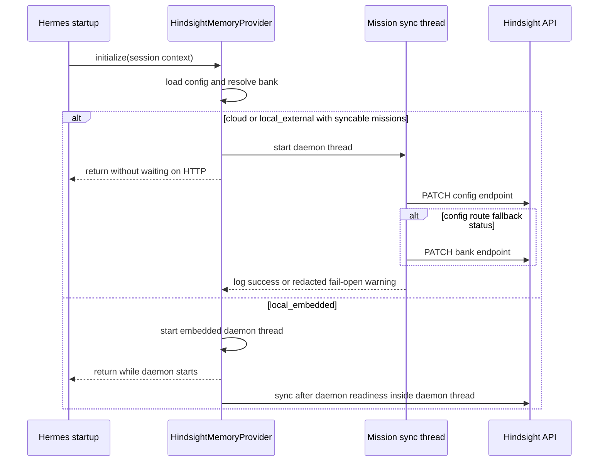

# fix: Finish Hindsight bank mission sync safely

**Target repo:** `hermes-agent`

## Summary

This plan finishes the current Hindsight bank mission sync branch by tightening the already-written implementation, fixing the startup-latency risk found during review, and shipping only the mission-sync behavior that the original plan scoped.

---

## Problem Frame

The current branch already implements and tests most of the Hindsight bank mission sync behavior from `docs/plans/2026-06-08-001-fix-hindsight-bank-mission-sync-plan.md`. Targeted Hindsight memory tests and ruff passed, but review found one real issue: non-embedded provider startup currently performs optional bank metadata sync synchronously, so a slow config route plus fallback can delay startup even though the feature is meant to be best-effort.

The continuation should not reopen the whole Hindsight capability surface. The right move is a small finishing pass: preserve the working endpoint/payload behavior, make optional sync startup-safe, verify the touched suite, and leave full-suite/environment cleanup out of this branch.

---

## Requirements

**Behavior preservation**

- R1. Preserve the existing mission mapping: `bank_mission` syncs to `reflect_mission`, and `bank_retain_mission` syncs to `retain_mission`.
- R2. Preserve the corrected Hindsight endpoint shape: prefer `PATCH /v1/default/banks/{bank_id}/config` with wrapped `updates`, then fall back to `PATCH /v1/default/banks/{bank_id}` only for the supported fallback statuses.
- R3. Preserve resolved-bank behavior, URL quoting, auth header handling, timeout configuration, blank-value omission, and redacted logging.

**Startup safety**

- R4. Cloud and `local_external` initialization must not block on optional bank mission sync network calls.
- R5. `local_embedded` sync must still run only after daemon readiness and must not turn mission-sync failure into daemon-start failure.
- R6. Mission sync exceptions, unsupported endpoints, and timeouts must remain fail-open for retain, recall, and reflect.

**Shipping discipline**

- R7. Do not expand scope into Hindsight MCP enablement, memory curation, bank migration, or profile-specific mission/name behavior.
- R8. Do not mutate the live `hermes-ops` bank, restart gateways, or change runtime config as part of this continuation.
- R9. Treat the full-suite timeout and `Too many open files` failure as an environment/full-repo follow-up unless targeted tests expose a patch-local regression.

---

## Key Technical Decisions

- **Make non-embedded sync asynchronous instead of stretching the deadline:** A single total deadline would still make startup wait for optional metadata. A daemon thread keeps startup available and matches the best-effort posture.
- **Keep `_sync_bank_missions` as the synchronous core:** The current helper already owns endpoint selection, fallback, and redacted fail-open behavior. The continuation should add a lifecycle wrapper rather than rewriting the network path.
- **Expose just enough thread state for deterministic tests:** Tests need a way to wait for the background mission-sync attempt without sleeping. Reuse a provider-owned thread attribute or add a narrow one; do not introduce a scheduler abstraction.
- **Limit simplification to clarity fixes touched by the continuation:** Remove dead imports and update the module docstring if needed. Defer broad request-helper extraction or fake-daemon fixture cleanup unless the startup-safety change naturally touches that code.
- **Do not chase the repo-wide suite inside this branch:** The targeted memory suite is the relevant gate. The full suite currently shows broad failures and `Too many open files`, which is a separate operations/testing-health problem.

---

## High-Level Technical Design

---

## Implementation Units

### U1. Reconcile the current branch state

- **Goal:** Confirm the continuation starts from the intended diff and does not accidentally inherit unrelated runtime edits.
- **Requirements:** R7, R8, R9
- **Dependencies:** none
- **Files:**
  - `plugins/memory/hindsight/__init__.py`
  - `plugins/memory/hindsight/README.md`
  - `tests/plugins/memory/test_hindsight_provider.py`
  - `website/docs/user-guide/features/memory-providers.md`
  - `website/i18n/zh-Hans/docusaurus-plugin-content-docs/current/user-guide/features/memory-providers.md`
- **Approach:** Review the current diff against the original plan and keep only files that support bank mission sync. Treat unrelated cleanup suggestions as follow-up unless they are needed for the startup-safety fix.
- **Test scenarios:**
  - Test expectation: none -- this is checkout/scope reconciliation, not behavior-bearing code.
- **Verification:** The working tree contains only the Hindsight provider, Hindsight tests, and Hindsight docs changes listed above.

### U2. Make cloud and local-external sync startup-safe

- **Goal:** Prevent optional mission-sync HTTP calls from blocking non-embedded provider initialization.
- **Requirements:** R4, R6
- **Dependencies:** U1
- **Files:**
  - `plugins/memory/hindsight/__init__.py`
  - `tests/plugins/memory/test_hindsight_provider.py`
- **Approach:** Add a provider-owned async launch point for bank mission sync in cloud and `local_external` modes. Keep `_sync_bank_missions` synchronous and unchanged as the core operation. The launch point should start a daemon thread only when there is syncable mission payload and should catch/log unexpected exceptions without leaking mission text or secrets.
- **Execution note:** Start with a failing startup-latency regression test before changing provider startup.
- **Patterns to follow:** The existing `local_embedded` daemon-start thread, current mission-sync tests under `TestBankMissionSync`, and existing redacted warning style in `plugins/memory/hindsight/__init__.py`.
- **Test scenarios:**
  - Happy path: cloud initialization with mission fields schedules mission sync and returns before a deliberately blocked fake PATCH can complete.
  - Happy path: `local_external` initialization schedules mission sync against the configured local API URL and still targets the quoted bank config endpoint.
  - Failure path: an exception raised inside the background sync worker is logged as fail-open and does not raise out of `initialize()`.
  - Edge case: no syncable mission fields does not create a background sync thread.
  - Integration path: after the background thread is joined in the test, the existing endpoint, payload, auth, fallback, timeout, and redaction assertions still pass.
- **Verification:** Non-embedded initialization no longer waits for mission-sync HTTP, and the existing mission-sync behavior remains covered by deterministic tests without sleeps.

### U3. Keep the implementation narrow and clean

- **Goal:** Address only cleanup that reduces shipping risk for this diff.
- **Requirements:** R3, R7
- **Dependencies:** U2
- **Files:**
  - `plugins/memory/hindsight/__init__.py`
  - `tests/plugins/memory/test_hindsight_provider.py`
- **Approach:** Remove any dead imports introduced by the current tests. Update the module-level environment summary for `HINDSIGHT_BANK_SYNC_TIMEOUT` if it remains accurate after U2. Avoid extracting a generic Hindsight request helper unless U2 creates new duplicated request logic.
- **Patterns to follow:** Existing compact provider docstring style and existing helper naming in the Hindsight provider.
- **Test scenarios:**
  - Test expectation: none -- this unit is non-behavioral cleanup; behavioral coverage remains in U2 and the existing mission-sync suite.
- **Verification:** Ruff reports no issues for the touched Python files, and the diff is smaller or clearer without changing behavior.

### U4. Re-run focused verification and document full-suite status honestly

- **Goal:** Establish the branch is ready for commit/PR without pretending the repo-wide suite is green.
- **Requirements:** R1, R2, R3, R4, R5, R6, R9
- **Dependencies:** U2, U3
- **Files:**
  - `tests/plugins/memory/test_hindsight_provider.py`
  - `plugins/memory/hindsight/README.md`
  - `website/docs/user-guide/features/memory-providers.md`
  - `website/i18n/zh-Hans/docusaurus-plugin-content-docs/current/user-guide/features/memory-providers.md`
- **Approach:** Run the targeted Hindsight memory provider tests, the Hindsight memory package tests, ruff over touched Python files, and diff hygiene. Attempting the full suite is optional; if repeated, record the timeout and environment failure separately from patch-local verification.
- **Test scenarios:**
  - Happy path: all `tests/plugins/memory` tests pass after the startup-safety change.
  - Regression path: the new startup-latency test fails before U2 and passes after U2.
  - Documentation check: docs describe best-effort startup behavior without promising immediate synchronous remote mutation.
- **Verification:** Targeted tests and lint pass; any full-suite failure is summarized with the observed environment symptom and not treated as a blocker unless it points to a changed Hindsight file.

### U5. Commit and prepare the PR without live activation

- **Goal:** Package the finished source/docs/test change for review while preserving the live-runtime approval boundary.
- **Requirements:** R7, R8, R9
- **Dependencies:** U4
- **Files:**
  - `docs/plans/2026-06-13-001-fix-hindsight-bank-sync-continuation-plan.md`
  - `plugins/memory/hindsight/__init__.py`
  - `plugins/memory/hindsight/README.md`
  - `tests/plugins/memory/test_hindsight_provider.py`
  - `website/docs/user-guide/features/memory-providers.md`
  - `website/i18n/zh-Hans/docusaurus-plugin-content-docs/current/user-guide/features/memory-providers.md`
- **Approach:** Commit the focused change and prepare a PR description that names the targeted verification and the full-suite limitation. Do not install a local carry, restart any gateway, or smoke-test against the live bank without a separate explicit approval.
- **Test scenarios:**
  - Test expectation: none -- this unit packages already-verified work.
- **Verification:** The branch has a clean working tree after commit, and the PR notes that deployment/runtime activation is separate from this source change.

---

## Scope Boundaries

### In scope

- Finishing the current Hindsight bank mission sync branch.
- Fixing the non-embedded startup-latency risk introduced by synchronous optional sync.
- Keeping docs aligned with best-effort asynchronous startup behavior.
- Preparing the branch for code review and PR.

### Deferred to Follow-Up Work

- Repo-wide test-suite health and the `Too many open files` failure observed during full-suite verification.
- Broad cleanup of duplicated fake embedded-daemon test setup.
- Shared request helper extraction for all Hindsight stdlib HTTP calls.
- Local carry installation, gateway restart, or live-bank smoke testing after explicit approval.

### Out of scope

- Hindsight MCP/admin enablement.
- Memory curation, deletion, migration, or budget changes.
- Profile-specific bank display-name behavior.
- Provider, model, API-key, or runtime config changes.

---

## Risks & Dependencies

- **Background-thread observability:** Moving non-embedded sync out of the startup path can hide failures unless logs remain specific and redacted. Tests should wait on the thread to prove the attempted sync still happens.
- **Test determinism:** Startup-latency coverage must use synchronization primitives, not sleeps. Sleep-based timing tests will flake.
- **Last-writer-wins metadata:** Bank mission sync still mutates bank metadata when a future process starts with reachable API access. The PR must keep the operator-facing warning intact.
- **Full-suite noise:** The observed full-suite timeout and file-descriptor error can bury patch-local signal. Keep this branch scoped to targeted verification and file a separate ops/testing-health item if needed.

---

## Documentation / Operational Notes

- Source changes do not mutate the live bank until a process imports the updated provider and starts with mission fields configured.
- No gateway restart or live-bank smoke test is part of this continuation plan.
- PR monitoring should watch Hindsight provider startup logs for redacted mission-sync success/failure lines after deployment and confirm retain/recall/reflect remain usable if sync fails.

---

## Sources / Research

- `docs/plans/2026-06-08-001-fix-hindsight-bank-mission-sync-plan.md` — original scope and safety boundaries.
- `plugins/memory/hindsight/__init__.py` — current provider startup, mission-sync helper, endpoint fallback, and embedded daemon thread.
- `tests/plugins/memory/test_hindsight_provider.py` — current mission-sync test suite and deterministic HTTP seam.
- `plugins/memory/hindsight/README.md` — plugin config table and operator-facing Hindsight behavior docs.
- `website/docs/user-guide/features/memory-providers.md` — user-facing memory provider docs.
- `website/i18n/zh-Hans/docusaurus-plugin-content-docs/current/user-guide/features/memory-providers.md` — translated user-facing memory provider docs.
