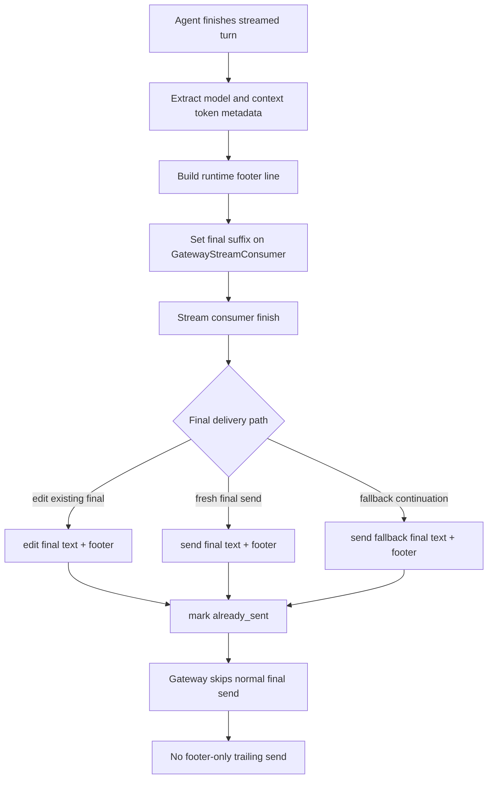

# fix: Keep runtime footer in streamed final messages

## Summary

Fix the Hermes gateway runtime footer so Telegram streaming includes the runtime metadata in the final assistant message instead of sending a footer-only trailing message. Make the token-count field durable in upstream code so the local `context_tokens` monkeypatch can be retired or reduced to a harmless no-op.

---

## Problem Frame

This is a repeat of the footer streaming failure found in past sessions. Session `20260602_194401_aac08d` diagnosed the original root cause: Telegram streaming marks the final body as already delivered, `gateway/run.py` skips appending the runtime footer under the `not already_sent` gate, then sends `_footer_line` as a separate message. Session `20260608_141026_9fcd2212` produced a handoff recommending final-suffix support in `GatewayStreamConsumer`, but the current checkout still has the trailing-send path.

Current verification shows a second issue in the same surface: `zzz_hermes_footer_tokens.pth` uses `os.path.expanduser('~/.hermes/patches')`. In this gateway/tool environment `HOME` can resolve to the profile home, so the footer token monkeypatch is not auto-imported at interpreter startup. A direct startup probe showed `hermes_footer_tokens preimported False`, no `_FooterTokensFinder`, and `format_runtime_footer(... fields=('context_tokens','context_pct'))` rendering only `12%` instead of `12K/100K · 12%`. That patch-loading bug explains the missing raw token field; it is not the cause of the separate footer message.

---

## Requirements

**Streaming delivery**

- R1. When runtime footer is enabled and gateway streaming delivers the final answer, the footer appears in the final assistant message body, not in a separate footer-only message.
- R2. The footer suffix is applied only to the true turn-final assistant message, not to interim commentary, tool-progress text, pre-tool preambles, or segment-break finalization.
- R3. If the stream consumer cannot safely mutate or send the final footer-bearing text, Hermes may omit the footer, but it must not send a footer-only trailing message.

**Token rendering**

- R4. `context_tokens` renders natively as `<tokens>/<context_length>` when selected in `display.runtime_footer.fields`.
- R5. Existing footer fields keep their current behavior, ordering, and skip-empty semantics.

**Patch/runtime hygiene**

- R6. The shared runtime no longer depends on the fragile footer-token monkeypatch for the desired footer content.
- R7. Any remaining `.pth` patch loader uses an absolute patch path or another profile-safe lookup so profile/gateway HOME changes cannot disable it silently.

---

## Key Technical Decisions

- **Move footer delivery into the stream finalization seam:** `GatewayStreamConsumer` is the component that knows which text is turn-final and whether it will edit, fresh-send, or fallback-send. Adding a final suffix there fixes the split without teaching every adapter about footers.
- **Delete the trailing footer send instead of keeping it as fallback:** Tobi explicitly does not want footer-only messages. A missing footer under rare failure is less bad than a recurring extra message after the answer.
- **Implement `context_tokens` upstream in `gateway/runtime_footer.py`:** The monkeypatch exists only because upstream skipped this field. Native support makes the behavior testable and survives `/update` without patch-loader coupling.
- **Treat `.pth` hardening as cleanup, not the primary footer split fix:** The separate-message bug is visible in `gateway/run.py` regardless of patch loading. The patch bug affects the raw token amount shown in the footer.

---

## High-Level Technical Design



---

## Implementation Units

### U1. Add native `context_tokens` footer rendering

- **Goal:** Make raw context token counts part of `gateway.runtime_footer` instead of a local monkeypatch-only field.
- **Requirements:** R4, R5, R6.
- **Dependencies:** None.
- **Files:**
  - `gateway/runtime_footer.py`
  - `tests/gateway/test_runtime_footer.py`
- **Approach:** Add a `context_tokens` branch to `format_runtime_footer` that renders `<short(context_tokens)>/<short(context_length)>` only when `context_length > 0` and `context_tokens >= 0`. Reuse the existing field-order loop and skip-empty behavior.
- **Patterns to follow:** Existing `context_pct` branch and `tests/gateway/test_runtime_footer.py` field-specific tests.
- **Test scenarios:**
  - With fields `("context_tokens", "context_pct")`, `context_tokens=12345`, and `context_length=100000`, output includes `12K/100K · 12%`.
  - With missing or zero `context_length`, `context_tokens` is skipped without placeholder text.
  - Existing `model`, `context_pct`, and `cwd` tests continue to pass unchanged.
- **Verification:** Runtime footer tests prove native raw-token rendering without importing `/Users/akira/.hermes/patches/hermes_footer_tokens.py`.

### U2. Add final-suffix support to `GatewayStreamConsumer`

- **Goal:** Let the gateway provide text that is appended exactly once to the true turn-final streamed message.
- **Requirements:** R1, R2, R3.
- **Dependencies:** U1 can run independently; U3 consumes this unit.
- **Files:**
  - `gateway/stream_consumer.py`
  - `tests/gateway/test_stream_consumer_draft.py`
- **Approach:** Add a small `set_final_suffix(text: str | None)` API and an idempotent helper that returns the original text when the suffix is blank or already present. Apply it only on `got_done` paths before `_send_or_edit(...)` or `_send_fallback_final(...)`; do not apply it on `got_segment_break`, commentary, overflow chunks that are not turn-final, or tool-boundary resets.
- **Patterns to follow:** Existing `got_done` vs `got_segment_break` separation in `GatewayStreamConsumer.run()` and the final-delivery flags `final_response_sent` / `final_content_delivered`.
- **Test scenarios:**
  - Streaming `hello`, setting suffix `gpt-5.5 · 12K/200K · 6%`, then `finish()` sends or edits one final message containing both body and suffix.
  - A segment break before tool execution finalizes the preamble without the suffix; the final answer after `got_done` receives the suffix.
  - Calling `set_final_suffix` with an already-present suffix does not duplicate it.
  - Fallback final-send path includes the suffix in the fallback final message.
- **Verification:** Stream-consumer tests fail on current code because no suffix API exists and pass after the finalization seam owns suffix delivery.

### U3. Build and pass the footer before stream finalization

- **Goal:** Move footer construction early enough that streamed finalization can include it.
- **Requirements:** R1, R3, R5.
- **Dependencies:** U2.
- **Files:**
  - `gateway/run.py`
  - `tests/gateway/test_runtime_footer.py` or a focused gateway runner test file if an existing harness covers `_run_agent`
- **Approach:** In the native gateway streaming path, extract `_last_prompt_toks`, `_context_length`, and `_resolved_model` before calling `_stream_consumer.finish()`. Build `_footer_line` with the existing `build_footer_line(...)` call and set it on the stream consumer before `finish()`. Keep the non-streaming append gate for normal final sends.
- **Patterns to follow:** Current footer build in `gateway/run.py`, current token extraction immediately after `result_holder[0] = result`, and existing streamed-final suppression at the `final_content_delivered` check.
- **Test scenarios:**
  - Simulated streamed final delivery with runtime footer enabled marks `already_sent=True` and delivers final text containing the footer.
  - Simulated non-streaming final delivery still appends the footer in the caller path.
  - Footer disabled produces no suffix and no behavior change.
- **Verification:** A focused gateway test proves `_stream_consumer.finish()` happens after footer suffix injection, not before token metadata exists.

### U4. Remove footer-only trailing sends

- **Goal:** Eliminate the explicit bug path that sends `_footer_line` as its own platform message when `agent_result["already_sent"]` is true.
- **Requirements:** R1, R3.
- **Dependencies:** U2, U3.
- **Files:**
  - `gateway/run.py`
  - `tests/gateway/test_runtime_footer.py` or the focused gateway runner test file from U3
- **Approach:** Delete the `_foot_adapter.send(...)` block in the `already_sent` branch while preserving media extraction/delivery. Update comments to state that streaming footer delivery is handled by the stream consumer and that footer-only fallback is intentionally forbidden.
- **Patterns to follow:** Existing media delivery branch under `already_sent` and the suppression log around final streamed delivery.
- **Test scenarios:**
  - With `agent_result["already_sent"] = True` and `_footer_line` populated, adapter `send(...)` is not called with a footer-only message.
  - Media delivery still runs when the response contains `MEDIA:` tags and `already_sent=True`.
- **Verification:** The regression test would fail on current `gateway/run.py:9005-9015` because it sends `_footer_line` separately.

### U5. Harden or retire the footer-token monkeypatch loader

- **Goal:** Prevent profile/gateway HOME changes from silently disabling remaining `.pth` patches and make the footer-token patch self-retire after U1.
- **Requirements:** R6, R7.
- **Dependencies:** U1.
- **Files:**
  - `venv/lib/python3.11/site-packages/zzz_hermes_footer_tokens.pth`
  - `venv/lib/python3.11/site-packages/zzz_hermes_subprocess_hermes_home.pth`
  - `docs/solutions/` only if the patch-loader lesson is captured separately
- **Approach:** Change footer-related `.pth` files that still use `os.path.expanduser('~/.hermes/patches')` to the absolute patch path pattern already used by `zzz_hermes_unbrand.pth`: `/Users/akira/.hermes/patches`. After U1, keep `hermes_footer_tokens.py` as a self-retiring no-op until the operator decides to remove it, or remove the `.pth` loader if tests and manual probe prove native rendering covers the configured fields.
- **Patterns to follow:** `zzz_hermes_unbrand.pth` already uses the absolute patch path and loads correctly in this environment.
- **Test scenarios:**
  - With `HOME=/Users/akira/.hermes/profiles/hermes-ops/home`, a fresh `venv/bin/python` startup shows the intended patch path in `sys.path` and imports any remaining patch module.
  - A fresh `venv/bin/python` import of `gateway.runtime_footer` renders `context_tokens` correctly even if `hermes_footer_tokens` is not imported.
- **Verification:** Startup probe no longer reports `hermes_footer_tokens preimported False` because of path expansion, or the probe confirms the patch is no longer needed because native rendering works without it.

---

## Sources & Research

- Past session `20260602_194401_aac08d`, “Fixing Hermes Footer Streaming Bug”: diagnosed the upstream split as `already_sent=True` suppressing footer append and the later trailing send delivering `_footer_line` separately.
- Past session `20260608_141026_9fcd2212`, “Runtime Footer Streaming Fix”: wrote `/tmp/hermes-runtime-footer-streaming-handoff.md` recommending final-suffix support in `GatewayStreamConsumer` and deletion of the trailing footer send.
- Current checkout: `gateway/run.py:8726-8745` still builds `_footer_line` after agent completion and only appends it when `not agent_result.get("already_sent")`.
- Current checkout: `gateway/run.py:8994-9016` still sends `_footer_line` through `adapter.send(...)` as a separate trailing message in the `already_sent` branch.
- Current checkout: `gateway/run.py:14597-14617` calls `_stream_consumer.finish()` before extracting `_last_prompt_toks`, `_context_length`, and `_resolved_model`, so streamed finalization currently cannot include the footer with accurate token metadata.
- Current checkout: `gateway/stream_consumer.py:594-642` owns the `got_done` final delivery paths that should receive a footer suffix.
- Current startup probe: `zzz_hermes_footer_tokens.pth` still uses `os.path.expanduser('~/.hermes/patches')`; with profile HOME, startup did not import `hermes_footer_tokens`, and native footer rendering ignored `context_tokens`.

---

## Risks & Dependencies

- **Streaming finalization has several paths:** Edit, fresh-final send, fallback send, overflow splitting, commentary, and segment boundaries must not receive different footer behavior accidentally.
- **Line-level references may drift:** Implement from the named functions and current code shape, not from line numbers alone.
- **Live gateway restart is separate:** Code changes will not affect running Telegram profiles until the relevant gateway processes restart. Do not restart live profiles without Tobi approval.
- **Working tree is already dirty:** Current uncommitted changes exist in `gateway/config.py`, `gateway/platforms/telegram.py`, `tests/gateway/test_telegram_rich_messages.py`, and `tools/send_message_tool.py`; implementation must avoid stomping them.

---

## Operational Notes

After implementation and tests pass, verify with a fresh interpreter and then with the running profile only if Tobi approves restart. The minimum non-live probe is:

```bash
HOME=/Users/akira/.hermes/profiles/hermes-ops/home venv/bin/python - <<'PY'
from gateway.runtime_footer import format_runtime_footer
print(format_runtime_footer(model='openai/gpt-5.5', context_tokens=12345, context_length=100000, cwd='', fields=('context_tokens','context_pct')))
PY
```

Expected output after U1 is `12K/100K · 12%` without relying on the monkeypatch.
