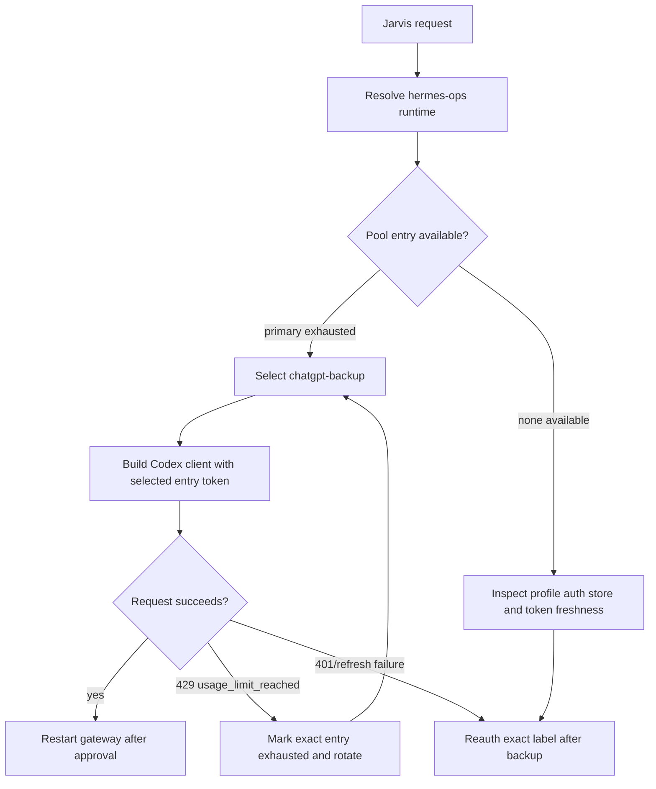

# fix: Restore Jarvis OpenAI Codex subscription rotation

## Summary

Jarvis (`hermes-ops`) is failing on `openai-codex` with `usage_limit_reached` even though the profile still lists `chatgpt-backup` as the current/available pool entry. This plan fixes the rotation path so Jarvis starts on, or reliably rotates to, the usable subscription instead of repeatedly calling the exhausted Plus account.

---

## Problem Frame

The live diagnosis shows Akira/default and Jarvis/hermes-ops both use `gpt-5.5` via `openai-codex` and both have two Codex OAuth pool entries. Akira/default can answer through `chatgpt-backup`, while Jarvis returns HTTP 429 on a tiny safe smoke test.

Observed Jarvis evidence:

- `hermes --profile hermes-ops auth list openai-codex` lists two credentials: `openai-codex-oauth-1` rate-limited and `chatgpt-backup` marked as current.
- Jarvis logs repeatedly show `HTTP 429: The usage limit has been reached` from `https://chatgpt.com/backend-api/codex`.
- The 429 body reports `plan_type: plus` and a reset around the same provider window, which matches a maxed ChatGPT Plus subscription.
- A direct CLI smoke test with `hermes --profile hermes-ops chat -q 'Reply with exactly: JARVIS_OK' --toolsets safe -Q` failed after three 429 retries.
- During that smoke test the logs showed retries against the same Codex endpoint, with no successful backup response.

The likely failure is not “OpenAI is down.” It is a profile-local runtime/auth mismatch: Jarvis has a backup pool entry visible to `auth list`, but the live inference path is still effectively using the exhausted account or failing to rotate into the backup during Codex streaming retries.

---

## Requirements

**Runtime behavior**

- R1. Jarvis must avoid an exhausted `openai-codex` pool entry when another non-exhausted entry exists.
- R2. Jarvis must pass a tiny direct smoke test through `hermes --profile hermes-ops chat` before the Telegram gateway is declared fixed.
- R3. Jarvis Telegram gateway must use the same profile-local auth state that passed the direct smoke test.

**Credential safety**

- R4. The fix must preserve both of Tobi’s independent ChatGPT/Codex subscriptions without silently syncing one token pair over both pool labels.
- R5. Any auth-store mutation must back up the target profile’s `auth.json` first and report only redacted fingerprints/statuses.
- R6. Live model/provider/API-key/runtime changes require Tobi’s explicit approval before execution.

**Diagnostics**

- R7. The fix must distinguish default/Akira auth state from Jarvis/hermes-ops auth state.
- R8. The implementation must leave clear evidence in logs or CLI output showing which pool entry was selected, rotated, or exhausted.

---

## Key Technical Decisions

- **Diagnose before mutating live config:** Tobi’s standing rule requires approval before live model/provider/API-key/runtime changes. The first implementation unit is read-only except for test artifacts.
- **Treat Jarvis as profile-local:** `default` and `hermes-ops` have separate auth stores, exhaustion markers, singleton provider tokens, and gateway processes. A working Akira credential does not prove Jarvis is wired correctly.
- **Prefer native Codex OAuth pools over proxy workarounds:** The intended design is `openai-codex` with `fill_first` fallback, not a proxy or provider swap.
- **Fix the selection/rotation path before pruning credentials:** `auth list` already sees `chatgpt-backup`; deleting/re-adding credentials without understanding why runtime ignores or fails rotation risks destroying the useful evidence.
- **Use exact-label reauth only if token independence is broken:** If both Jarvis pool entries resolve to the same underlying account or stale token lineage, refresh `chatgpt-backup` with a separate browser/session and then prune stale entries by exact label after backup.

---

## Scope Boundaries

### In scope

- Diagnose Jarvis/hermes-ops Codex runtime selection, pool availability, and 429 recovery.
- Repair profile-local auth/pool state if approved.
- Patch Hermes code if the pool is visible but the Codex streaming path does not select or rotate correctly.
- Restart the Jarvis gateway only after Tobi approves the live runtime change.

### Deferred to Follow-Up Work

- Adding a dashboard UI for subscription health.
- Changing global defaults for all Hermes profiles.
- Reworking the entire credential-pool strategy system.

### Out of scope

- Upgrading or changing Tobi’s OpenAI subscriptions.
- Switching Jarvis away from `openai-codex` as the primary fix.
- Printing raw OAuth access tokens or refresh tokens.

---

## High-Level Technical Design

The critical invariant is that the runtime client must be built from the selected pool entry, not from the exhausted singleton provider token, and 429 recovery must mark the exact failed entry before retrying.

---

## Implementation Units

### U1. Capture profile-local runtime evidence

- **Goal:** Produce a clean before/after diagnostic packet for Jarvis without changing live config.
- **Requirements:** R2, R5, R7, R8
- **Dependencies:** None
- **Files:**
  - `hermes_cli/runtime_provider.py`
  - `agent/credential_pool.py`
  - `agent/agent_init.py`
  - `agent/codex_runtime.py`
  - `run_agent.py`
  - `tests/agent/test_credential_pool.py`
- **Approach:** Compare `hermes auth list openai-codex` and `hermes --profile hermes-ops auth list openai-codex`, then inspect redacted pool metadata for `last_status`, `last_error_*`, token fingerprints, `source`, `last_refresh`, and provider singleton metadata. Confirm whether runtime resolution returns both an `api_key` and a `credential_pool`, because that combination can accidentally initialize on singleton credentials while expecting reactive pool recovery later.
- **Patterns to follow:** Use existing redaction patterns in `hermes_cli/auth.py` and credential-pool status display rather than dumping secrets.
- **Test scenarios:**
  - Happy path: a profile with primary exhausted and backup available reports backup as selectable.
  - Error path: a profile with all entries exhausted reports no available entries and includes cooldown/reset context.
  - Integration: a direct `hermes --profile hermes-ops chat` smoke test is run before any Telegram gateway restart.
- **Verification:** The diagnostic packet states whether Jarvis is failing because the backup subscription is also exhausted, the backup token is stale, or the runtime is not selecting the backup.

### U2. Verify Codex pool selection at agent initialization

- **Goal:** Ensure a profile with a credential pool starts each request on the selected available pool entry rather than the provider singleton token.
- **Requirements:** R1, R2, R4, R8
- **Dependencies:** U1
- **Files:**
  - `agent/agent_init.py`
  - `run_agent.py`
  - `tests/agent/test_credential_pool_routing.py`
  - `tests/run_agent/test_fallback_credential_isolation.py`
- **Approach:** Add or adjust initialization logic so an `openai-codex` agent constructed with a pool selects an available entry before creating the initial OpenAI client. Preserve the singleton guard that prevents silent account swaps when the active runtime token differs from singleton tokens.
- **Patterns to follow:** Mirror the existing `_swap_credential(entry)` path and the guard comments around singleton refresh in `run_agent.py`.
- **Test scenarios:**
  - Happy path: primary exhausted, backup available; initialization uses backup token fingerprint.
  - Edge case: no pool entries available; initialization falls back to the existing singleton/error path without hiding the failure.
  - Error path: backup token refresh fails; the entry is marked correctly and the user-facing error mentions reauth instead of retrying the exhausted primary.
  - Integration: Codex Cloudflare headers are rebuilt using the selected backup token.
- **Verification:** Logs show the selected pool label before the first Codex request, and a tiny Jarvis CLI smoke test returns `JARVIS_OK`.

### U3. Fix Codex 429 recovery for exact-entry rotation

- **Goal:** Make `usage_limit_reached` mark the actual failed Codex pool entry and retry with the next available credential.
- **Requirements:** R1, R2, R4, R8
- **Dependencies:** U2
- **Files:**
  - `agent/agent_runtime_helpers.py`
  - `agent/credential_pool.py`
  - `agent/codex_runtime.py`
  - `run_agent.py`
  - `tests/agent/test_credential_pool.py`
  - `tests/agent/test_credential_pool_routing.py`
- **Approach:** Trace the Codex streaming error path and ensure `recover_with_credential_pool` receives enough context to rotate on `usage_limit_reached`. If the failed request used singleton credentials, recover by selecting the next pool entry only when doing so does not violate the silent-account-swap guard.
- **Patterns to follow:** Existing `mark_exhausted_and_rotate` and `_swap_credential` semantics; do not introduce provider-specific hacks outside the credential-pool abstraction unless Codex token/header handling requires it.
- **Test scenarios:**
  - Happy path: first Codex request gets 429 from primary, recovery rotates to backup, second attempt succeeds.
  - Edge case: 429 body lacks `last_error_reset_at`; the entry is still exhausted with a clear status and does not block a healthy backup.
  - Error path: all entries 429; the final error reports all pool entries exhausted rather than implying missing auth.
  - Integration: subagent requests inherit the same pool recovery behavior as main-agent requests.
- **Verification:** Jarvis logs include `marking <label> exhausted`, `rotated to <label>`, and a successful API call after rotation.

### U4. Repair Jarvis profile auth state after code-path verification

- **Goal:** Refresh or prune only the Jarvis/hermes-ops credential entries that are proven stale or duplicated.
- **Requirements:** R3, R4, R5, R6, R7
- **Dependencies:** U1, and U2/U3 if code-path defects are confirmed
- **Files:**
  - `hermes_cli/auth.py`
  - `agent/credential_pool.py`
  - `tests/hermes_cli/test_non_ascii_credential.py`
  - `tests/agent/test_credential_pool.py`
- **Approach:** After Tobi approves live auth work, back up the Jarvis auth store, refresh the intended backup account using exact-label device-code auth, verify token fingerprints changed only for the intended entry, and remove stale entries only by exact label/id. Use a separate browser profile or incognito session so the backup login does not silently authenticate into the already-maxed account.
- **Execution note:** Treat this as a live-runtime operation; stop for explicit approval before auth-store mutation or gateway restart.
- **Patterns to follow:** Existing profile-local pool refresh workflow and exact-label auth removal commands.
- **Test scenarios:**
  - Happy path: refreshing `chatgpt-backup` updates that entry and preserves `openai-codex-oauth-1` audit state.
  - Edge case: device-code login reuses the wrong browser account; token/account evidence does not validate and the operation stops before pruning.
  - Error path: refresh token reuse marks the entry dead and instructs exact-label reauth.
- **Verification:** `hermes --profile hermes-ops auth list openai-codex` shows the intended backup available, and redacted metadata confirms independent token fingerprints.

### U5. Restart and verify Jarvis Telegram gateway

- **Goal:** Apply the fixed runtime to live Jarvis only after approval and prove Telegram uses the repaired profile.
- **Requirements:** R2, R3, R5, R6, R8
- **Dependencies:** U2, U3, U4 as needed
- **Files:**
  - `gateway/run.py`
  - `hermes_cli/main.py`
  - `tests/gateway/test_weak_credential_guard.py`
- **Approach:** Restart `hermes-ops` gateway through the supported profile gateway command or launchd kickstart. Then send a minimal Jarvis Telegram prompt and confirm the gateway logs show a successful `openai-codex` call with no new `usage_limit_reached` retries.
- **Patterns to follow:** Profile gateway restart and launchd fallback guidance from the Hermes runtime operations workflow.
- **Test scenarios:**
  - Happy path: Jarvis answers in Telegram after restart using the repaired Codex pool.
  - Edge case: CLI smoke passes but Telegram fails; inspect gateway env/profile loading rather than changing auth again.
  - Error path: gateway restart fails; report supervisor error and leave auth state unchanged.
- **Verification:** Direct CLI smoke and Telegram smoke both pass, and recent `hermes-ops` logs contain no fresh 429s for the validation session.

---

## Risks & Dependencies

- **OAuth account-selection risk:** Device-code login may reuse the browser account that is already maxed. Use a separate browser profile or incognito session for backup reauth.
- **Token-sync risk:** Existing Codex auth helpers have history around syncing fresh device-code tokens into multiple pool entries. Verify exact-label preservation before pruning anything.
- **Live gateway risk:** Restarting Jarvis changes a live Telegram bot. Do it only after Tobi approves.
- **False-positive backup status:** `auth list` can show an entry as current while the request path still initializes on singleton credentials. Runtime smoke tests are the source of truth.

---

## Documentation / Operational Notes

After the fix lands, update the Hermes runtime profile operations notes with the verified Jarvis-specific failure mode if it is not already covered: `auth list` showing a backup entry does not guarantee Codex streaming initialized with that entry.

For future incidents, the minimum safe command sequence is:

1. Compare default and target profile `auth list` output.
2. Inspect redacted profile-local `auth.json` metadata.
3. Run a direct profile CLI smoke test.
4. Only then restart the Telegram gateway.

---

## Sources / Research

- `agent/credential_pool.py` — pool selection, exhaustion, refresh, and rotation behavior.
- `agent/agent_init.py` — OpenAI client initialization path when runtime supplies `api_key`, `base_url`, and `credential_pool`.
- `agent/agent_runtime_helpers.py` — recovery behavior for 429/auth failures.
- `run_agent.py` — `_swap_credential` and singleton refresh guard behavior.
- `gateway/run.py` — profile runtime passed into gateway-created agents.
- Live diagnostic output from `hermes --profile hermes-ops auth list openai-codex` and a failed Jarvis CLI smoke test on 2026-06-18.
